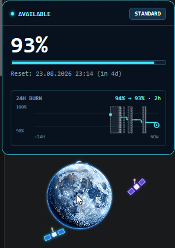
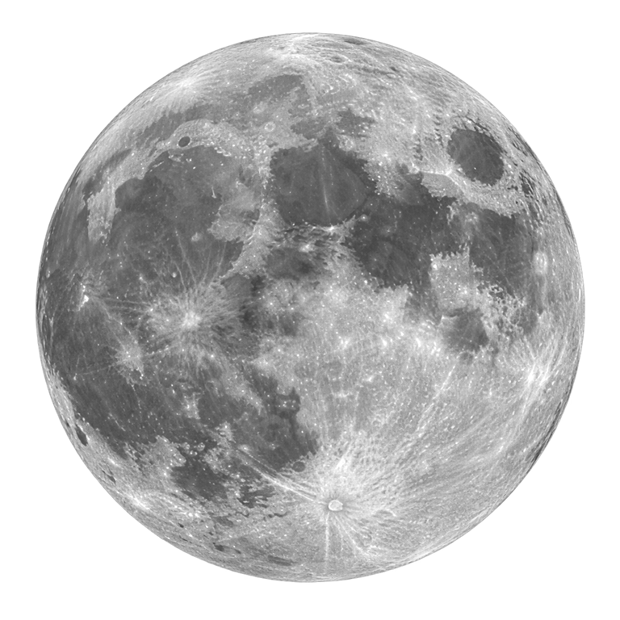
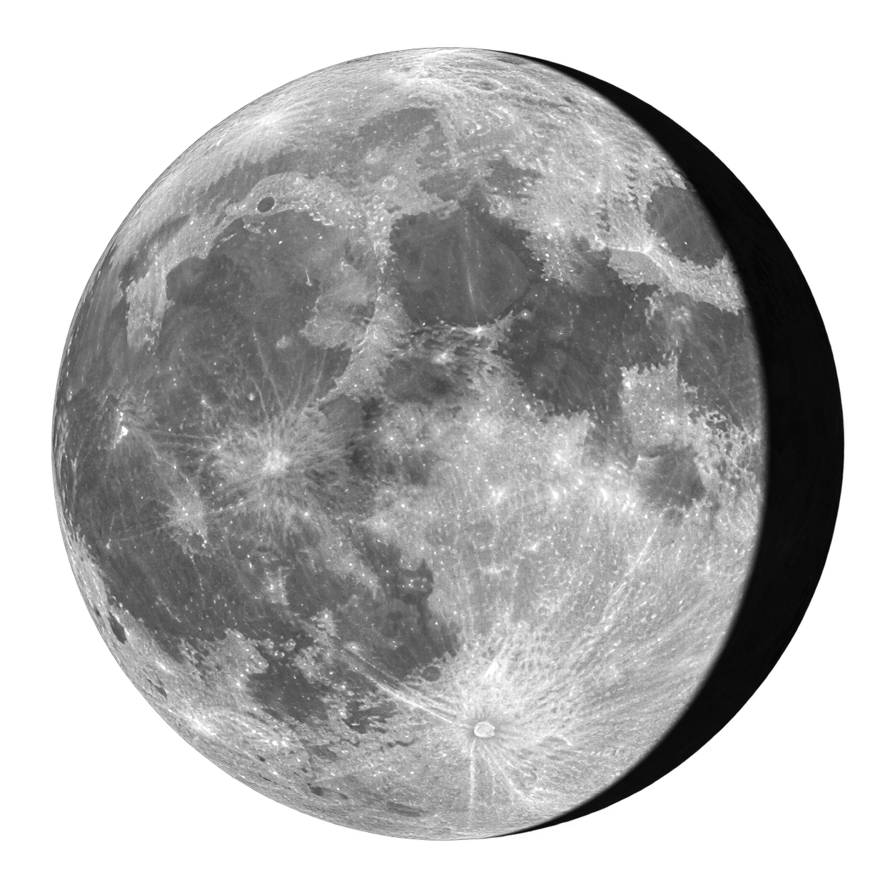
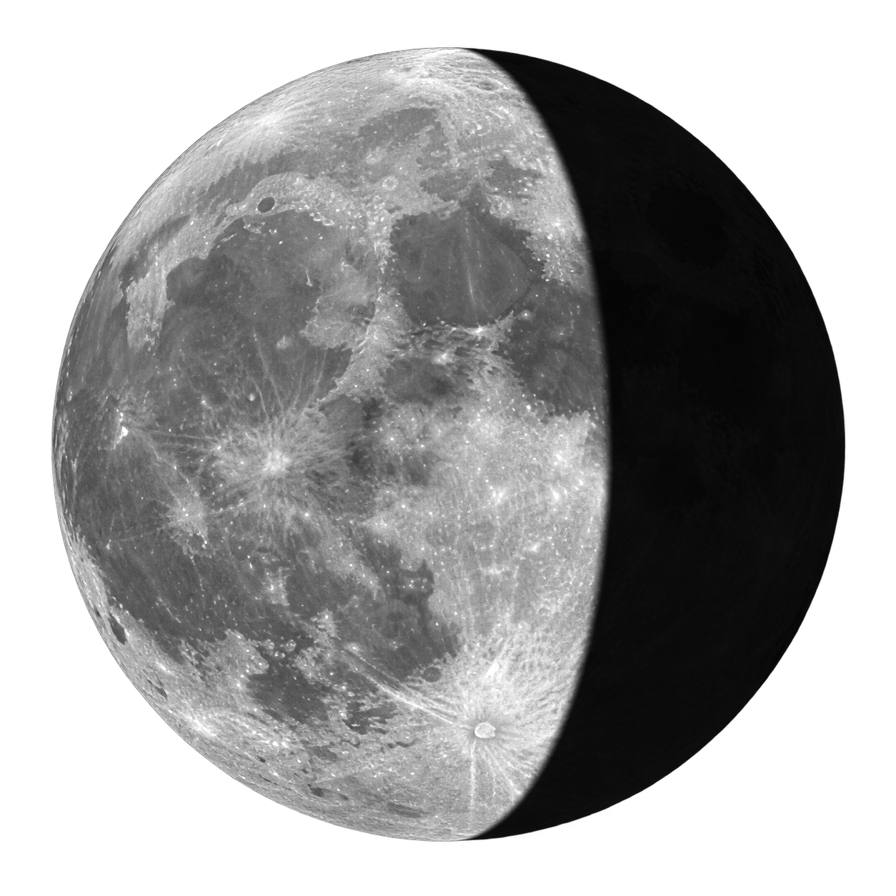
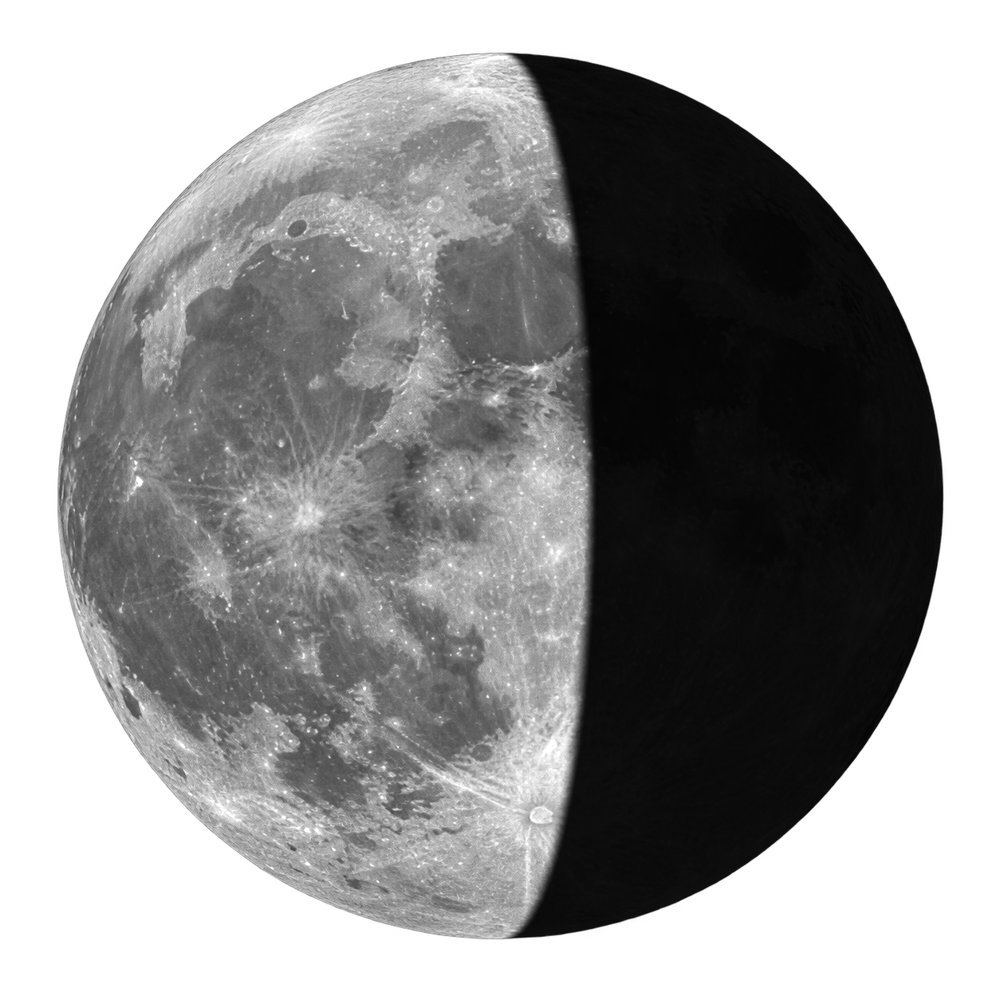
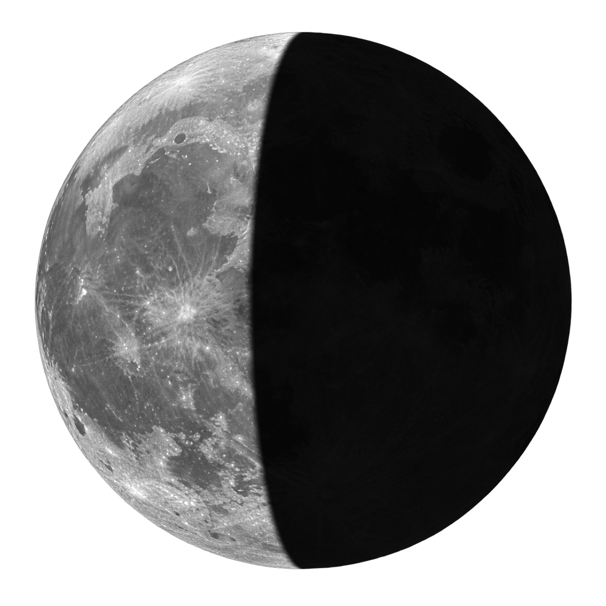
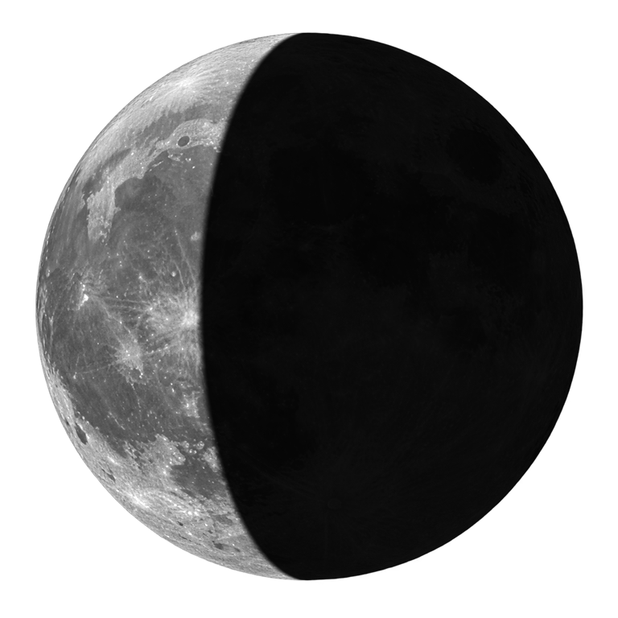
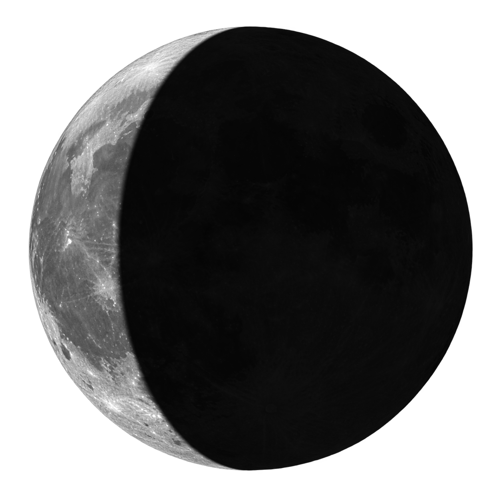
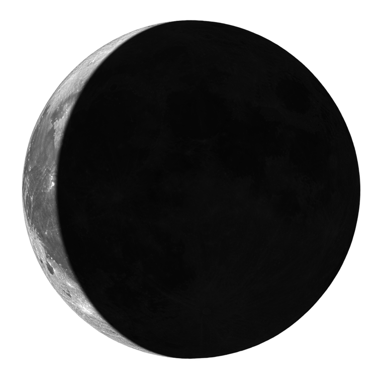

# Quota Wisp for Windows

An original, local-only Windows 11 desktop pet that shows Codex quota. For the macOS project that inspired this Windows implementation, see [codex-quota-pet](https://github.com/danya-kim99/codex-quota-pet).

## Features

- Transparent always-on-top WPF pet with an original animated moon-and-satellites image.
- Primary and secondary quota, reset time, Standard/Turbo mode.
- Local Codex App Server JSON-RPC; no telemetry and no remote service.
- Automatic reconnect, event refresh, 60-second polling and hover refresh.
- Stale callbacks from replaced Codex connections are discarded.
- Smooth and pixel tooltip styles, English and Russian UI.
- S/M/L sizes, drag, lock, click-through, multi-monitor position restore.
- Transparent window padding passes pointer input to applications underneath.
- Hide in fullscreen apps and user-level Windows startup.
- 30-day local quota history, consumption reactions and weighted interactive objects.

## Tooltip preview

Hover over the moon to open the quota dashboard with the exact remaining percentage, reset time, and 24-hour consumption history.

<p align="center">
  
</p>

## Moon quota states

The remaining quota is displayed in 10% bands. The full moon is used for 91–100%, and the thinnest waning phase is used for 0–10%.

<table>
  <tr>
    <td align="center"><br><strong>Quota: 91–100%</strong></td>
    <td align="center"><br><strong>Quota: 81–90%</strong></td>
    <td align="center"><br><strong>Quota: 71–80%</strong></td>
    <td align="center"><br><strong>Quota: 61–70%</strong></td>
    <td align="center"><br><strong>Quota: 51–60%</strong></td>
  </tr>
  <tr>
    <td align="center"><br><strong>Quota: 41–50%</strong></td>
    <td align="center"><br><strong>Quota: 31–40%</strong></td>
    <td align="center"><br><strong>Quota: 21–30%</strong></td>
    <td align="center"><br><strong>Quota: 11–20%</strong></td>
    <td align="center"><br><strong>Quota: 0–10%</strong></td>
  </tr>
</table>

## Run

Extract `QuotaWisp-win-x64.zip` and run `QuotaWisp.exe`. The build is self-contained and does not require .NET to be installed. Windows SmartScreen may show an unknown-publisher warning because the executable is not code-signed.

Quota Wisp looks for `codex.exe`, `codex.cmd`, or `codex.ps1` in standard locations and `PATH`. A custom path can be selected from the tray menu.

Settings and history are stored under `%LOCALAPPDATA%\QuotaWisp`. Enabling startup adds the current executable to `HKCU\Software\Microsoft\Windows\CurrentVersion\Run`.

## Build and verify

```powershell
dotnet run --project .\Tests\QuotaWisp.SelfTest.csproj
.\build-portable.ps1
# Build a specific release version locally:
.\build-portable.ps1 -Version 1.1.0
```

The project targets Windows 11 x64 and .NET 8 WPF. It has no third-party runtime dependencies.

## Automated releases

GitHub Actions builds and publishes a portable ZIP whenever a semantic-version tag such as `v1.1.0` is pushed. The workflow runs the self-tests, produces a self-contained Windows x64 build, creates or updates the matching GitHub Release, and uploads `QuotaWisp-win-x64.zip` with replacement enabled. Therefore the permanent download URL below always resolves to the asset from the latest non-prerelease release:

```text
https://github.com/Demian87/codex-quota-pet-win/releases/latest/download/QuotaWisp-win-x64.zip
```

Create a release after this workflow is merged into the default branch:

```powershell
git tag v1.1.0
git push origin v1.1.0
```

The workflow can also be started manually for an existing `vX.Y.Z` tag from the Actions tab. It requires the repository's default `GITHUB_TOKEN` with `contents: write`; no signing certificate or additional secret is required. Re-running it for the same tag replaces the existing ZIP instead of creating a duplicate asset.

## Artwork

`Assets/moon-master.png` is an original AI-generated project asset created for this Windows implementation. Generation prompt: a realistic full disk of Earth's Moon with neutral white and gray crater detail, transparent background, and no blue tint, atmosphere, baked-in halo, text, logos, or additional objects. It was generated with the built-in image generation tool. `generate-moon-assets.ps1` deterministically produces the ten neutral-color quota phases and the application icon from that master; the first waning phase starts at exactly 90% remaining quota. WPF adds a small neutral-white glow at runtime without recoloring the lunar surface.

## Landing page

The dependency-free landing page lives in [`website/`](website/). It uses the same ten moon-phase images and product screenshot as the desktop application. Run `./website/build.ps1` to create a local `website/dist/` directory and `website/QuotaWisp-landing.zip`.
